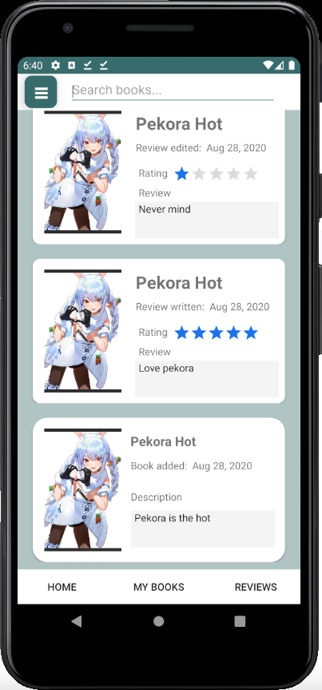
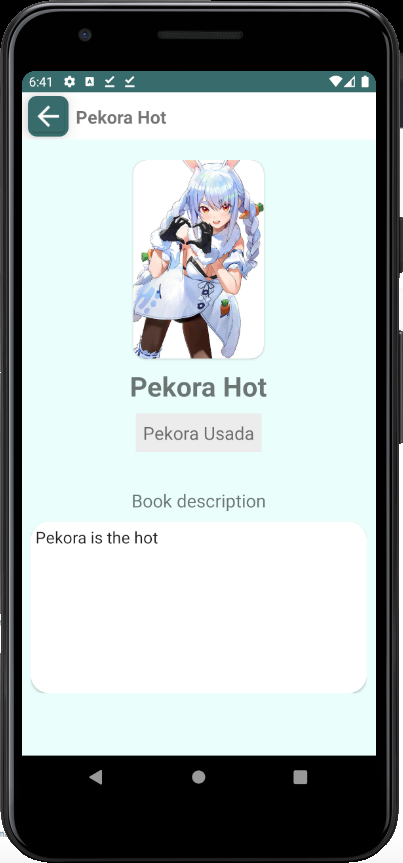
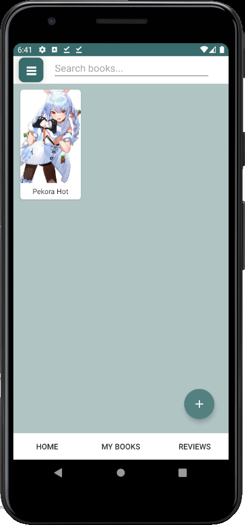
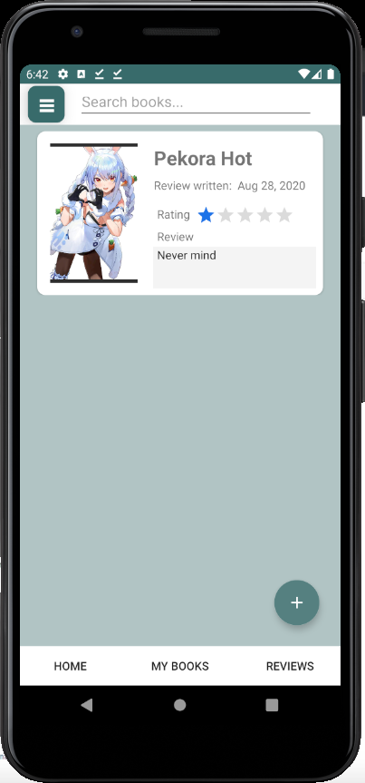
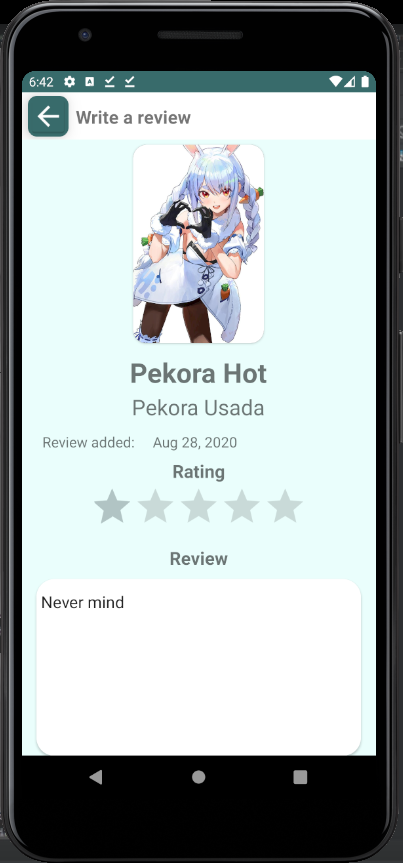
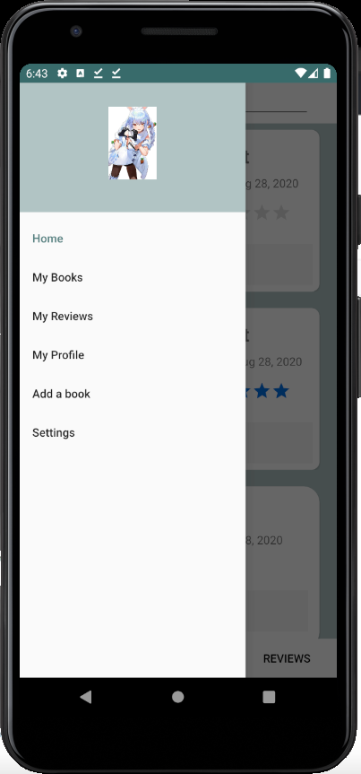
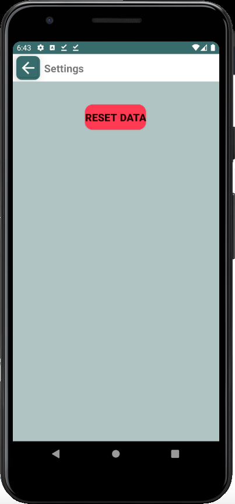

<!--
*** Thanks for checking out this README Template. If you have a suggestion that would
*** make this better, please fork the repo and create a pull request or simply open
*** an issue with the tag "enhancement".
*** Thanks again! Now go create something AMAZING! :D
***
***
***
*** To avoid retyping too much info. Do a search and replace for the following:
*** github_username, repo_name, twitter_handle, email
-->


<!-- PROJECT LOGO -->
<br />
<p align="center">
  <a href="https://github.com/github_username/repo_name">
    
  </a>

  <h1 align="center">Bookly</h3>

  <p align="center">
    An android application whose purpose is to serve as a library. Users can store books and reviews of the book that they've read. 
    <br />
    <br />
    <br />
    <a href="https://github.com/github_username/repo_name">View Demo</a>
    ·
    <a href="https://github.com/Puh00/Bookly/issues">Report Bug</a>
    ·
    <a href="https://github.com/Puh00/Bookly/issues">Request Feature</a>
  </p>
</p>


<!-- TABLE OF CONTENTS -->
## Table of Contents

* [About the Project](#about-the-project)
  * [Built With](#built-with)
* [Getting Started](#getting-started)
  * [Prerequisites](#prerequisites)
  * [Installation](#installation)
* [Roadmap](#roadmap)
* [Contributing](#contributing)
* [License](#license)
* [Contact](#contact)
* [Acknowledgements](#acknowledgements)


<!-- ABOUT THE PROJECT -->
## About The Project

<p align="center">
  
  
</p>
<p align="center">
Homepage to the left, detailed view of book to the right.
</p>

<p align="center">
  
  
</p>
<p align="center">
An overview of the books to the left, reviews on the right.
</p>

<p align="center">
  
  
</p>
<p align="center">
WriteAReview to the left, profile page to the right.
</p>

<p align="center">
  
  
</p>
<p align="center">
Sidepanel which can be accessed through hamburger button on the left, settings page to the right.
</p>


### Built With

* [Android Studio](https://developer.android.com/studio)
* [Kotlin](https://kotlinlang.org/)


<!-- GETTING STARTED -->
## Getting Started

To get a local copy up and running follow these simple steps.

### Prerequisites

* Android Studio and its emulator.
```sh
Install android 30 sdk.
```

### Installation

1. Clone the repo.
```sh
git clone https://github.com/Puh00/Bookly.git
```
2. Build the application with.


<!-- ROADMAP -->
## Roadmap

See the [open issues](https://github.com/Puh00/Bookly/issues) for a list of proposed features (and known issues).


<!-- CONTRIBUTING -->
## Contributing

Contributions are what make the open source community such an amazing place to be learn, inspire, and create. Any contributions you make are **greatly appreciated**.

1. Fork the Project
2. Create your Feature Branch (`git checkout -b feature/AmazingFeature`)
3. Commit your Changes (`git commit -m 'Add some AmazingFeature'`)
4. Push to the Branch (`git push origin feature/AmazingFeature`)
5. Open a Pull Request


<!-- LICENSE -->
## License

Distributed under the MIT License. See `LICENSE` for more information.


<!-- CONTACT -->
## Contact

Puh00 - [Github](https://github.com/Puh00)

kusuoki (yn) - [Github](https://github.com/kusuoki)

Project Link: [https://github.com/Puh00/Bookly](https://github.com/Puh00/Bookly)


<!-- ACKNOWLEDGEMENTS -->
## Acknowledgements
* [Kotlin](https://kotlinlang.org/docs/reference/)
* [Code Lab](https://codelabs.developers.google.com/)
* [Developers Android](https://developer.android.com/docs/)
* [Medium](https://medium.com/)
* [respect ppy](https://github.com/ppy)


<!-- MARKDOWN LINKS & IMAGES -->
<!-- https://www.markdownguide.org/basic-syntax/#reference-style-links -->
[contributors-url]: https://github.com/github_username/repo/graphs/contributors
[forks-shield]: https://img.shields.io/github/forks/github_username/repo.svg?style=flat-square
[forks-url]: https://github.com/github_username/repo/network/members
[stars-shield]: https://img.shields.io/github/stars/github_username/repo.svg?style=flat-square
[stars-url]: https://github.com/github_username/repo/stargazers
[issues-shield]: https://img.shields.io/github/issues/github_username/repo.svg?style=flat-square
[issues-url]: https://github.com/github_username/repo/issues
[license-shield]: https://img.shields.io/github/license/github_username/repo.svg?style=flat-square
[license-url]: https://github.com/github_username/repo/blob/master/LICENSE.txt
[linkedin-shield]: https://img.shields.io/badge/-LinkedIn-black.svg?style=flat-square&logo=linkedin&colorB=555
[linkedin-url]: https://linkedin.com/in/github_username
[product-screenshot]: images/screenshot.png
