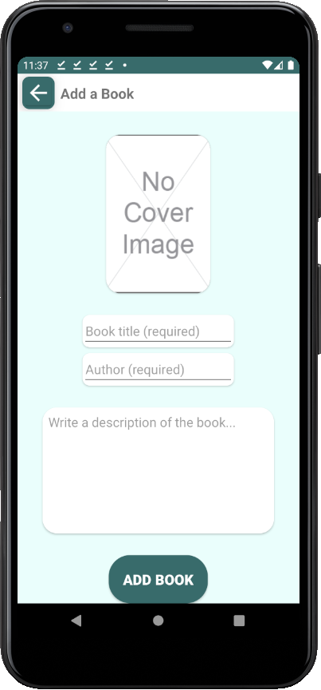
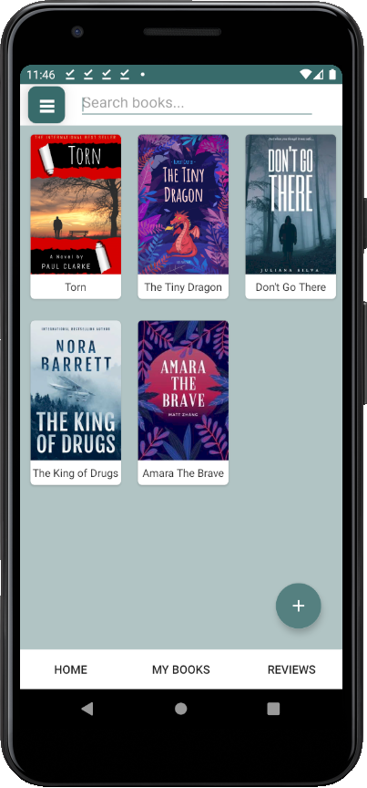
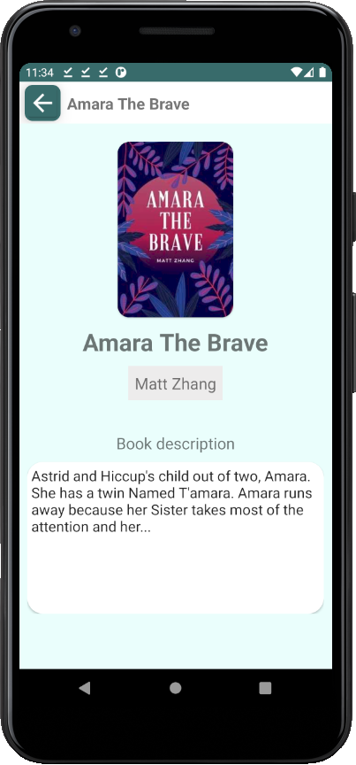
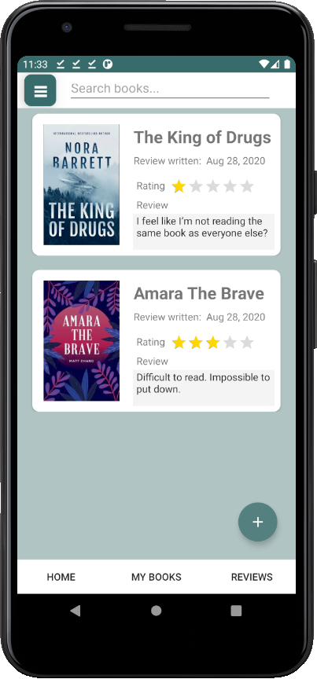
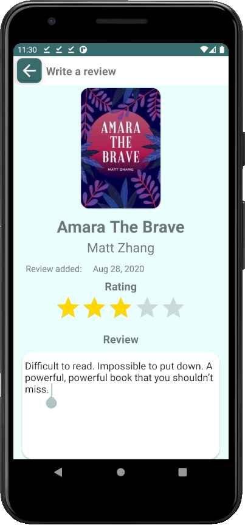
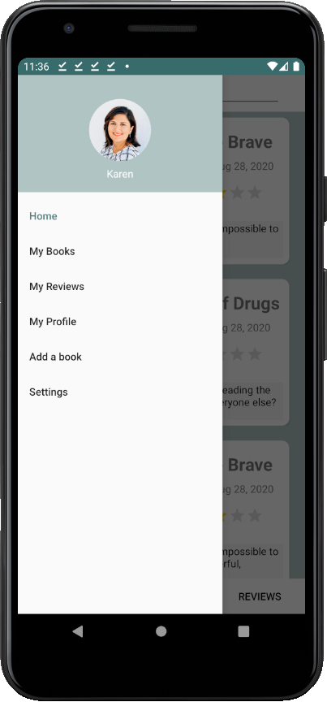
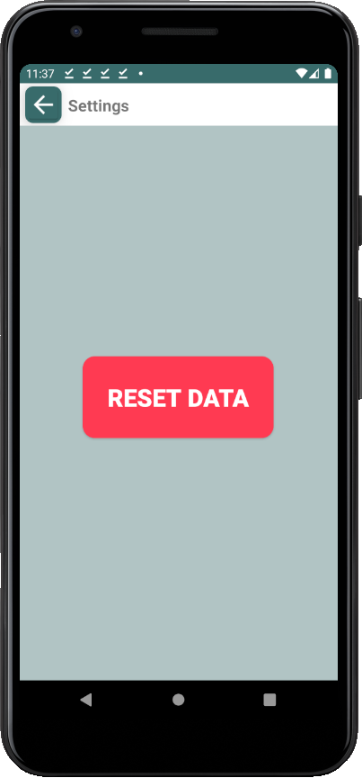

<!--
*** Thanks for checking out this README Template. If you have a suggestion that would
*** make this better, please fork the repo and create a pull request or simply open
*** an issue with the tag "enhancement".
*** Thanks again! Now go create something AMAZING! :D
***
***
***
*** To avoid retyping too much info. Do a search and replace for the following:
*** github_username, repo_name, twitter_handle, email
-->


<!-- PROJECT LOGO -->
<br />
<p align="center">
  <a href="https://github.com/github_username/repo_name">
    
  </a>

  <h1 align="center">Bookly</h3>

  <p align="center">
    An android application whose purpose is to serve as a library. Users can not only store books, but also reviews of the books that they've read. 
    <br />
      <br />
    <a href="https://github.com/Puh00/Bookly/releases/tag/v1.0">View Demo</a>
    ·
    <a href="https://github.com/Puh00/Bookly/issues">Report Bug</a>
    ·
    <a href="https://github.com/Puh00/Bookly/issues">Request Feature</a>
      <br />
  </p>
</p>


<!-- TABLE OF CONTENTS -->
## Table of Contents

* [About the Project](#about-the-project)
  * [Screenshots](#screenshots)
  * [Built With](#built-with)
* [Getting Started](#getting-started)
  * [Prerequisites](#prerequisites)
  * [Installation](#installation)
* [License](#license)
* [Contact](#contact)
* [Acknowledgements](#acknowledgements)


<!-- ABOUT THE PROJECT -->
## About The Project


A project which was done during the summer after freshman year. The aim of this project was to freshen up our programming skills and to run a small scale software project in order to expand our repertoire. 

<!-- Screenshots -->
### Screenshots
<p align="center">
  
  
</p>
<p align="center">
Homepage to the left, adding a book to the right.
</p>

<p align="center">
  
  
</p>
<p align="center">
An overview of the books to the left and a detailed view of the book to the right.
</p>

<p align="center">
  
  
</p>
<p align="center">
Reviews to the left, write a review to the right.
</p>

<p align="center">
   
</p>
<p align="center">
  Profile page.
</p>

<p align="center">
  
  
</p>
<p align="center">
Sidepanel which can be accessed through hamburger button on the top-left, settings page to the right.
</p>


### Built With

* [Android Studio](https://developer.android.com/studio)
* [Kotlin](https://kotlinlang.org/)


<!-- GETTING STARTED -->
## Getting Started

To get a local copy up and running follow these simple steps.

### Prerequisites

* Android Studio.
```sh
Minimum android 30 sdk.
```

### Installation

1. Clone the repo.
```sh
git clone https://github.com/Puh00/Bookly.git
```
2. Build the application with the in-built emulator (preferably 'Pixel 3a').

<!-- LICENSE -->
## License

Distributed under the MIT License. See [`LICENSE`](https://github.com/Puh00/Bookly/blob/master/LICENSE) for more information.


<!-- CONTACT -->
## Contact

Puh00 - [Github](https://github.com/Puh00)

yenanw (yn) - [Github](https://github.com/yenanw)

Project Link: [https://github.com/Puh00/Bookly](https://github.com/Puh00/Bookly)


<!-- ACKNOWLEDGEMENTS -->
## Acknowledgements
* [Kotlin](https://kotlinlang.org/docs/reference/)
* [Code Lab](https://codelabs.developers.google.com/)
* [Developers Android](https://developer.android.com/docs/)
* [Medium](https://medium.com/)
* [respect ppy](https://github.com/ppy)
